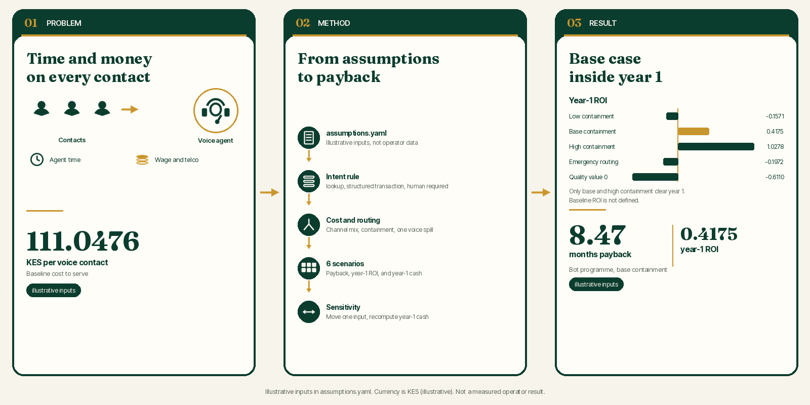
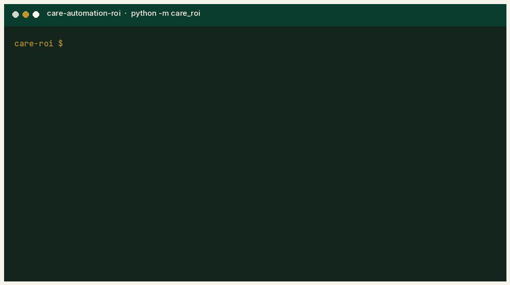
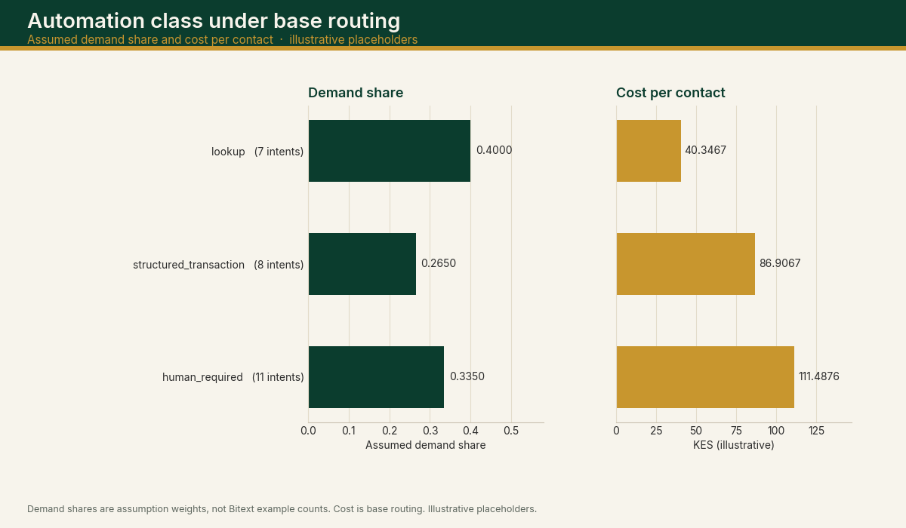
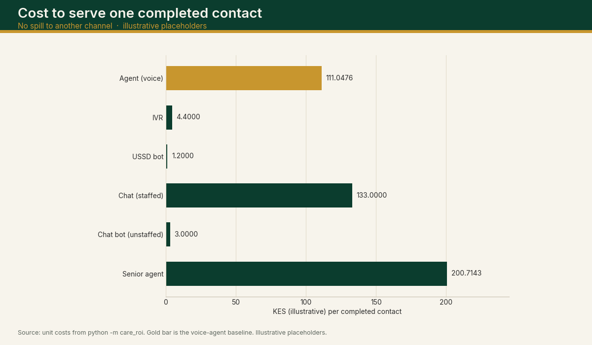
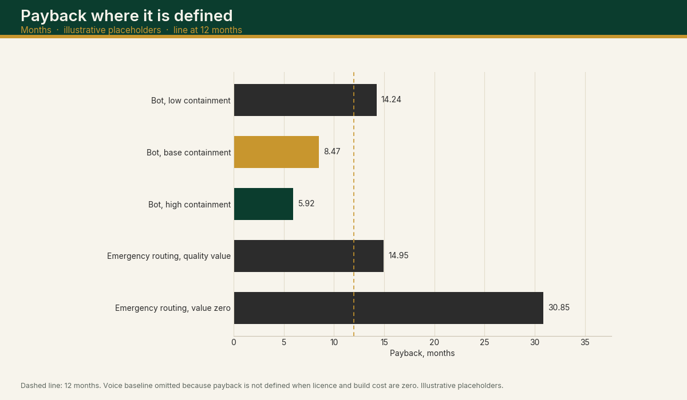
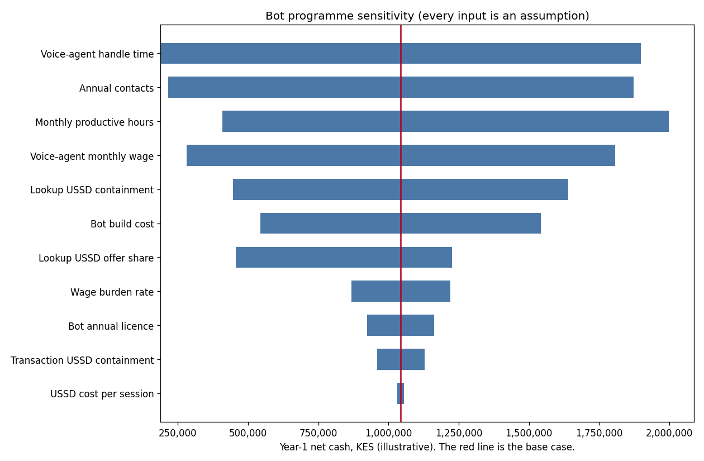

# Contact-centre automation ROI and cost-to-serve

**[Live demo](https://care-automation-roi.vercel.app)**



*Problem, method, and result. The left panel is the voice-agent cost to serve, the middle panel is the model pipeline, and the right panel is base-case payback and year-1 ROI. The gold bar is the bot programme at base containment. Illustrative inputs. Currency is KES (illustrative).*

[](https://github.com/ChristopherKiokoStrathmore/care-automation-roi/actions/workflows/ci.yml)

[](LICENSE)

Automating customer care saves agent time, but at what licence and build cost, and how sensitive is the case to containment rates?

This repo is a configurable cost-benefit model: editable assumptions in `assumptions.yaml`, 6 scenarios, cost to serve per contact, payback and year-1 ROI, a sensitivity tornado, and an n8n prototype export for escalation. Structured as a cost-benefit analysis. Part of an independent portfolio series on telecom customer analytics, built alongside my MSc in Data Science. It builds on the CRISP-DM projects in that series.

## Key results (capability and scope)

These headline figures are the committed outputs in `reports/summary.json`, produced from the illustrative inputs in `assumptions.yaml`.

- Base-case payback (bot programme at base containment) is 8.47 months.
- Year-1 ROI on that base case is 0.4175.
- Low-containment year-1 ROI is -0.1571.
- 6 scenarios from voice-only baseline to bot with triage routing.
- Metrics computed: cost per contact, annual operating saving, net annual benefit, payback months, year-1 ROI, year-1 net cash, plus a sensitivity analysis.
- 25 automated tests; CI regenerates reports and checks they match.
- All inputs are illustrative placeholders (KES, illustrative); swap in real data and rerun.

## Live demo

Interactive cost-benefit calculator for these assumptions and formulas: editable inputs, the six scenarios, payback, year-1 ROI, and the sensitivity tornado. The app is the Next.js project in [`web/`](web/). Currency is KES (illustrative).

**Live demo:** [https://care-automation-roi.vercel.app](https://care-automation-roi.vercel.app)

Deploy on Vercel with the project **Root Directory** set to `web`. From `web/`, `npm install`, `npm run dev`, and `npm run build`. `npm run verify` checks the default case against `reports/`.

## Demo



*Terminal recording of the CLI. It runs the model into a temporary directory, repeats the run with `volume.annual_contacts` set to 100000, then checks the committed reports. The text is the process stdout. Illustrative placeholders.*

## Problem

A contact centre that moves work off the voice agent onto a bot only saves money when those contacts stay contained, and only after licence and build cost. This model prices that case from editable assumptions and shows which assumption moves year-1 cash the most.

A contact has an intent. The intent's automation class comes from the rule in the generated section below, applied to the public Bitext category and intent name. The class is `lookup`, `structured_transaction`, or `human_required`.

Demand is a weight per intent in `assumptions.yaml`. The weight is divided by the sum of the weights. Bitext publishes 1000 training examples of each intent, so those counts are not used as demand.

## Options

The comparison is six scenarios. Labels and figures are in the generated scenario table. Every input is an illustrative placeholder.

1. Baseline: every contact on a voice agent. Licence and build cost are zero, so payback and ROI are not defined.
2. Bot programme, low containment: each containment rate is the base assumption minus `containment_scenario_delta`, clamped to [0, 1].
3. Bot programme, base containment: the headline bot case. No triage, and no assumed quality value.
4. Bot programme, high containment: each containment rate is the base assumption plus the same delta, clamped to [0, 1].
5. Bot programme plus emergency routing, with an assumed quality value.
6. The same triage path with that quality value set to zero, so the operating result can be read on its own.

The baseline sends every contact to a voice agent. The bot programme offers each class a mix of USSD bot, chat bot, IVR, and voice agent. The mix is an assumption and sums to 1 inside each class. A contact offered to USSD, chat bot, or IVR always pays that channel's unit cost. With probability equal to the containment rate it stops there. Otherwise it also pays one voice-agent contact. There is one spill step, and no further repeat contact.

Triage is a separate switch on the base containment path. The public [MULTI-HEAD](https://github.com/ChristopherKiokoStrathmore/MULTI-HEAD-) classifier has urgency labels `low`, `medium`, and `emergency`. This model treats `emergency` as the urgent class. A predicted emergency contact skips the bot and pays the senior-agent unit cost. Prevalence, precision, and recall are assumptions, checked so they can sit in one confusion matrix: precision must be at least recall times prevalence. The true-positive value and the false-negative penalty are assumptions as well. They are reported in their own column so they are not mixed into the operating cost. MULTI-HEAD documents no accuracy metric. This repo does not treat any triage accuracy as a measured figure. The smoke gates in that repo are described there as harness-health thresholds, and they are not copied in as model quality.



*Assumed demand share and cost per contact under base routing. Demand shares are the weights in `demand_weight_by_intent`, not the Bitext training counts. Illustrative placeholders. Currency is KES (illustrative).*

## Costs

Unit cost of a contact completed on a channel, with no spill:

- Voice agent, and senior agent: handle minutes divided by 60, times the fully loaded hourly wage, plus a per-minute telecom charge. Fully loaded hourly wage is monthly wage times (1 + burden rate), divided by monthly productive hours.
- Staffed chat: the same wage formula on the chat handle time, plus a platform charge per contact. The telecom per-minute charge is not applied.
- IVR: IVR minutes times the IVR per-minute charge, plus an IVR platform charge.
- USSD bot: sessions per contact times the cost per session.
- Chat bot: the unstaffed platform charge only.



*Unit cost of one completed contact, with no spill. The gold bar is the voice agent. Illustrative placeholders. Currency is KES (illustrative).*

Build cost and the annual licence sit outside the unit cost. The bot programme uses `investment.bot_build_cost` and `investment.bot_annual_licence`. The triage scenarios add `investment.triage_build_cost` and `investment.triage_annual_licence` on top of the bot figures. The currency label is KES (illustrative).

## Benefits

Annual operating saving is annual contacts times (baseline cost per contact minus scenario cost per contact). The triage scenarios also book an assumed quality value: true positives times `triage.value_per_true_positive`, minus false negatives times `triage.penalty_per_false_negative`, times annual contacts. That quality figure is an assumption, reported in its own column. The zero-value triage row shows the same operating path with that assumption removed.

Net annual benefit is the operating saving, plus the assumed quality value, minus the annual licence.

## ROI and payback

The model has no discount rate and does not compute NPV. Payback in months is build cost divided by net annual benefit over 12, and it is undefined when net annual benefit is not positive. Year-1 ROI is (net annual benefit minus build cost) divided by build cost. Year-1 net cash is net annual benefit minus build cost. Build cost is treated as spent in year 1, so a payback longer than 12 months goes with a negative year-1 ROI. There is no tax and no ramp-up.



*Payback in months where it is defined. The dashed line is 12 months. The voice baseline is omitted because payback is not defined when licence and build cost are zero. Illustrative placeholders.*

## Sensitivity

The sensitivity chart moves one assumption by the relative swing in `assumptions.yaml` and recomputes year-1 net cash for the bot programme at base containment. The other assumptions stay put. Lookup USSD offer moves against the voice-agent share of that class so the shares still sum to 1. A move that would push a share outside [0, 1] is clamped, and the clamp is flagged in the sensitivity table in the generated block.

## Recommendation

On these illustrative placeholders, the bot programme pays back inside year 1 at base containment (payback 8.47 months, year-1 ROI 0.4175, illustrative) and at high containment (payback 5.92 months, year-1 ROI 1.0278, illustrative). At low containment, payback is 14.24 months and year-1 ROI is -0.1571 (illustrative). Both emergency-routing options also miss year-1 payback on these inputs (illustrative): year-1 ROI is -0.1972 with the assumed quality value and -0.6110 with that value set to zero.

The conditional reading is: the bot programme clears a one-year test when containment stays at the base assumption or better, and the low-containment case does not. Adding emergency routing raises cost to serve on these placeholders, and the assumed quality value does not close the year-1 gap. Swap in measured inputs before treating any figure as a business case.

## Implementation note

The n8n file is a prototype export: [workflows/n8n_emergency_escalation.json](workflows/n8n_emergency_escalation.json). [workflows/README.md](workflows/README.md) says how to import it. It has not been imported into a running n8n instance, and it has not been run live.

## How to run

Requires Python 3.12.

```bash
pip install -r requirements.txt
python -m care_roi
pytest -q
```

`python -m care_roi` reads `assumptions.yaml`, writes `reports/`, and refreshes the generated block below when you pass `--write-readme README.md`.

Change one assumption without editing the file, and write the trial somewhere other than the committed `reports/` directory:

```bash
python -m care_roi --set volume.annual_contacts=100000 --out /tmp/roi-try
```

`--check` regenerates the text reports in a temporary directory and compares them to `reports/`.

`pytest` checks the unit-cost formula, a containment case, the triage counts, payback, the intent rule, the header that labels every assumption value as an illustrative placeholder, and that `reports/` plus the generated README block match a fresh run. GitHub Actions runs that suite on `main`.

## Replace these assumptions with operator data

Keep the formulas. Replace the numbers in `assumptions.yaml`, then rerun `python -m care_roi --write-readme README.md` and commit the new `reports/` files.

| Placeholder | What to put in its place |
| --- | --- |
| `volume.annual_contacts` | Offered contacts in a year, from the contact-centre platform, with the channel and the intent tag you will use below. |
| `demand_weight_by_intent` | The count of contacts per intent from that same tagged history. Do not paste the Bitext example count. |
| Handle times | Average handle time by the same channel definitions this file uses (voice agent, senior agent, staffed chat, IVR). |
| Wages, burden, productive hours | Fully loaded employment cost and hours that are actually available for contacts, from payroll, not a salary survey copied into the file without a source note. |
| Telecom and session charges | The tariff the operation pays for the voice minute, the IVR minute, and the USSD session. |
| `routing_share` | The share of each intent class the operation will actually offer to each channel. |
| `containment_rate` | Contained contacts divided by contacts offered to that channel, by intent class, from the bot's own logs. A contained contact is one that did not continue to an agent for the same issue. |
| Triage prevalence, precision, recall | A labelled sample scored against the model you will route with. Leave them as assumptions until that sample exists. Do not quote a smoke-test gate as precision or recall. |
| Quality value and miss penalty | A figure the operation is willing to book for a correctly escalated emergency and for a missed one, with the definition written next to it. Until then, read the scenario that sets this value to zero. |
| Build cost and licence | The implementation budget and the contracted annual fee. |

After the swap, the rule that tags Bitext names is still only a rule about names. Retire an intent from `lookup` or `structured_transaction` if the operation's own review says a person has to handle it.

## Data and scope

Built on public Bitext intent names and illustrative assumptions as an independent portfolio project.

<!-- BEGIN GENERATED FIGURES -->

The figures in this block are written by `python -m care_roi` from `assumptions.yaml` and the Bitext intent file. Currency is KES (illustrative). Every input is an illustrative placeholder, not a real operator figure. Per-contact costs are shown to 4 decimal places. Annual amounts are the exact product, then rounded to the cent, so a hand product of the rounded unit costs can differ by a few cents.

### Headline scenario results

Baseline voice-agent cost per contact: 111.0476 KES (illustrative).
Baseline annual operating cost: 13,325,714.29 KES (illustrative).

Bot programme at base containment, cost per contact: 76.5173 KES (illustrative).
Bot programme annual operating saving versus the voice baseline: 4,143,640.00 KES (illustrative).
Bot programme net annual benefit after the annual licence: 3,543,640.00 KES (illustrative).
Bot programme payback: 8.47 months.
Bot programme year-1 ROI: 0.4175.
Bot programme year-1 net cash (net annual benefit minus build cost): 1,043,640.00 KES (illustrative).

Low containment (base minus the delta in assumptions.yaml), payback: 14.24 months. Year-1 ROI: -0.1571.
High containment (base plus the delta), payback: 5.92 months. Year-1 ROI: 1.0278.

Triage routing treats the public MULTI-HEAD urgency label `emergency` as the urgent class. Precision and recall are assumptions. That repository documents no accuracy figure, and none is used here as a measurement.

Assumed emergency prevalence 0.0800, recall 0.7500, precision 0.4000.
Per contact, the implied rates are true positive 0.0600, false positive 0.0900, false negative 0.0200, true negative 0.8300, predicted emergency 0.1500.
On the assumed annual volume, that is 7,200 true positives, 10,800 false positives, 2,400 false negatives, and 18,000 contacts sent to a senior agent.
Triage scenario cost per contact: 95.1468 KES (illustrative). Assumed quality value for the year: 1,200,000.00 KES (illustrative). Net annual benefit: 2,328,094.00 KES (illustrative). Payback: 14.95 months. Year-1 ROI: -0.1972.
The same triage path with the assumed quality value set to zero has net annual benefit 1,128,094.00 KES (illustrative) and payback 30.85 months.

### Cost to serve one completed contact

These are unit costs with no spill. A contained bot contact pays only the bot unit cost. A miss pays the bot unit cost and one voice-agent contact. Staffed chat is the chat channel in the unit-cost table. The chat bot row is the unstaffed platform cost used when a contact is contained on chat.

| Channel | Cost per contact (KES (illustrative)) |
| --- | ---: |
| Agent (voice) | 111.0476 |
| IVR | 4.4000 |
| USSD bot | 1.2000 |
| Chat (staffed) | 133.0000 |
| Chat bot (unstaffed) | 3.0000 |
| Senior agent | 200.7143 |

### Which Bitext intents the rule marks as automation candidates

Rule, applied in this order:

- 1. If the Bitext category is COMPLAINTS, the class is human_required (clause category_complaints).
- 2. If the intent is customer_service, human_agent, activate_phone, deactivate_phone, install_internet, cancel_plan, or change_provider, or the intent name starts with dispute_, the class is human_required (clause explicit_human_or_dispute).
- 3. If the intent name starts with check_, or the intent is invoices or payment_methods, the class is lookup (clause lookup_name).
- 4. If the intent is pay, schedule_payments, set_usage_limits, activate_roaming, activate_call_management_services, deactivate_call_management_services, change_plan, or sign_up_for_plan, the class is structured_transaction (clause explicit_transaction).
- 5. Any other intent raises an error. A new Bitext intent is not classified by a default.

The taxonomy file has 26 intents and 26000 training examples, 1000 per intent. That balance is how the Bitext training set was built. It is not demand. Demand shares below come from `demand_weight_by_intent` in assumptions.yaml.

Upstream file sha256 recorded in `data/bitext_meta.json`: `0905820a880783d1a00f92d4f519488479f9eefe770cbfb5737f9462135d6c12`.

| Automation class | Intents | Share of intent names | Assumed demand share | Cost per contact under base routing |
| --- | ---: | ---: | ---: | ---: |
| lookup | 7 | 0.2692 | 0.4000 | 40.3467 |
| structured_transaction | 8 | 0.3077 | 0.2650 | 86.9067 |
| human_required | 11 | 0.4231 | 0.3350 | 111.4876 |

Intent detail is in [reports/intent_classification.csv](reports/intent_classification.csv). `n_examples` in that file is the training-set count. `demand_share` is the assumption weight divided by the sum of weights.

### Scenario table

| Scenario | Cost per contact | Annual operating saving | Assumed quality value | Net annual benefit | Payback (months) | Year-1 ROI |
| --- | ---: | ---: | ---: | ---: | ---: | ---: |
| Baseline: every contact on a voice agent | 111.0476 | 0.00 | 0.00 | 0.00 | not defined | not defined |
| Bot programme, low containment | 88.4882 | 2,707,128.00 | 0.00 | 2,107,128.00 | 14.24 | -0.1571 |
| Bot programme, base containment | 76.5173 | 4,143,640.00 | 0.00 | 3,543,640.00 | 8.47 | 0.4175 |
| Bot programme, high containment | 63.8023 | 5,669,434.29 | 0.00 | 5,069,434.29 | 5.92 | 1.0278 |
| Bot programme plus emergency routing, with assumed quality value | 95.1468 | 1,908,094.00 | 1,200,000.00 | 2,328,094.00 | 14.95 | -0.1972 |
| Bot programme plus emergency routing, quality value set to zero | 95.1468 | 1,908,094.00 | 0.00 | 1,128,094.00 | 30.85 | -0.6110 |

Full columns, including licence and build cost, are in [reports/scenarios.csv](reports/scenarios.csv).

### Sensitivity

The chart swings one assumption at a time by `sensitivity_relative_swing` and recomputes year-1 net cash for the bot programme at base containment. Lookup USSD offer moves against the voice-agent share of that class so the shares still sum to 1. A move that would push a share outside [0, 1] is clamped, and the clamp is flagged in [reports/sensitivity.csv](reports/sensitivity.csv).

Base year-1 net cash on the chart: 1,043,640.00 KES (illustrative).



The same chart as HTML: [reports/charts/roi_sensitivity_tornado.html](reports/charts/roi_sensitivity_tornado.html).

The cash columns are the result at the low input and the result at the high input. For wages, handle time, build cost, and licence, a higher input produces lower year-1 net cash.

| Assumption moved | Input low | Input high | Clamped | Year-1 net cash at low input | Year-1 net cash at high input |
| --- | ---: | ---: | --- | ---: | ---: |
| Voice-agent handle time | 6.4 | 9.6 | no | 188,262.40 | 1,899,017.60 |
| Annual contacts | 96000 | 144000 | no | 214,912.00 | 1,872,368.00 |
| Monthly productive hours | 112 | 168 | no | 1,997,320.00 | 407,853.33 |
| Voice-agent monthly wage | 64000 | 96000 | no | 280,696.00 | 1,806,584.00 |
| Lookup USSD containment | 0.56 | 0.84 | no | 446,648.00 | 1,640,632.00 |
| Bot build cost | 2000000 | 3000000 | no | 1,543,640.00 | 543,640.00 |
| Lookup USSD offer share | 0.64 | 0.85 | high input | 455,864.00 | 1,227,320.00 |
| Wage burden rate | 0.24 | 0.36 | no | 867,576.00 | 1,219,704.00 |
| Bot annual licence | 480000 | 720000 | no | 1,163,640.00 | 923,640.00 |
| Transaction USSD containment | 0.32 | 0.48 | no | 958,888.46 | 1,128,391.54 |
| USSD cost per session | 0.8 | 1.2 | no | 1,055,145.60 | 1,032,134.40 |

### Assumptions

Every number in this file is an illustrative placeholder, not a real operator figure.

Currency code: KES. Currency label: KES (illustrative).

| Assumption | Value | Label |
| --- | ---: | --- |
| `volume.annual_contacts` | 120000 | illustrative placeholder, not a real operator figure |
| `wages.voice_agent_monthly_wage` | 80000 | illustrative placeholder, not a real operator figure |
| `wages.chat_agent_monthly_wage` | 70000 | illustrative placeholder, not a real operator figure |
| `wages.senior_agent_monthly_wage` | 120000 | illustrative placeholder, not a real operator figure |
| `wages.burden_rate` | 0.30 | illustrative placeholder, not a real operator figure |
| `wages.monthly_productive_hours` | 140 | illustrative placeholder, not a real operator figure |
| `handle_time_minutes.voice_agent` | 8 | illustrative placeholder, not a real operator figure |
| `handle_time_minutes.senior_agent` | 10 | illustrative placeholder, not a real operator figure |
| `handle_time_minutes.live_chat` | 12 | illustrative placeholder, not a real operator figure |
| `handle_time_minutes.ivr` | 3 | illustrative placeholder, not a real operator figure |
| `channel_variable.voice_telco_per_minute` | 1.50 | illustrative placeholder, not a real operator figure |
| `channel_variable.ivr_per_minute` | 0.80 | illustrative placeholder, not a real operator figure |
| `channel_variable.ivr_platform_per_contact` | 2.00 | illustrative placeholder, not a real operator figure |
| `channel_variable.ussd_per_session` | 1.00 | illustrative placeholder, not a real operator figure |
| `channel_variable.ussd_sessions_per_contact` | 1.20 | illustrative placeholder, not a real operator figure |
| `channel_variable.live_chat_platform_per_contact` | 3.00 | illustrative placeholder, not a real operator figure |
| `channel_variable.chat_bot_platform_per_contact` | 3.00 | illustrative placeholder, not a real operator figure |
| `routing_share.lookup.ussd_bot` | 0.80 | illustrative placeholder, not a real operator figure |
| `routing_share.lookup.chat_bot` | 0.10 | illustrative placeholder, not a real operator figure |
| `routing_share.lookup.ivr` | 0.05 | illustrative placeholder, not a real operator figure |
| `routing_share.lookup.voice_agent` | 0.05 | illustrative placeholder, not a real operator figure |
| `routing_share.structured_transaction.ussd_bot` | 0.30 | illustrative placeholder, not a real operator figure |
| `routing_share.structured_transaction.chat_bot` | 0.20 | illustrative placeholder, not a real operator figure |
| `routing_share.structured_transaction.ivr` | 0.10 | illustrative placeholder, not a real operator figure |
| `routing_share.structured_transaction.voice_agent` | 0.40 | illustrative placeholder, not a real operator figure |
| `routing_share.human_required.ussd_bot` | 0.00 | illustrative placeholder, not a real operator figure |
| `routing_share.human_required.chat_bot` | 0.00 | illustrative placeholder, not a real operator figure |
| `routing_share.human_required.ivr` | 0.10 | illustrative placeholder, not a real operator figure |
| `routing_share.human_required.voice_agent` | 0.90 | illustrative placeholder, not a real operator figure |
| `containment_rate.lookup.ussd_bot` | 0.70 | illustrative placeholder, not a real operator figure |
| `containment_rate.lookup.chat_bot` | 0.65 | illustrative placeholder, not a real operator figure |
| `containment_rate.lookup.ivr` | 0.50 | illustrative placeholder, not a real operator figure |
| `containment_rate.structured_transaction.ussd_bot` | 0.40 | illustrative placeholder, not a real operator figure |
| `containment_rate.structured_transaction.chat_bot` | 0.45 | illustrative placeholder, not a real operator figure |
| `containment_rate.structured_transaction.ivr` | 0.20 | illustrative placeholder, not a real operator figure |
| `containment_rate.human_required.ussd_bot` | 0.00 | illustrative placeholder, not a real operator figure |
| `containment_rate.human_required.chat_bot` | 0.00 | illustrative placeholder, not a real operator figure |
| `containment_rate.human_required.ivr` | 0.00 | illustrative placeholder, not a real operator figure |
| `containment_scenario_delta` | 0.20 | illustrative placeholder, not a real operator figure |
| `demand_weight_by_intent.check_usage` | 140 | illustrative placeholder, not a real operator figure |
| `demand_weight_by_intent.invoices` | 90 | illustrative placeholder, not a real operator figure |
| `demand_weight_by_intent.check_mobile_payments` | 50 | illustrative placeholder, not a real operator figure |
| `demand_weight_by_intent.payment_methods` | 30 | illustrative placeholder, not a real operator figure |
| `demand_weight_by_intent.check_excess_data_charges` | 40 | illustrative placeholder, not a real operator figure |
| `demand_weight_by_intent.check_signal_coverage` | 35 | illustrative placeholder, not a real operator figure |
| `demand_weight_by_intent.check_cancellation_fee` | 15 | illustrative placeholder, not a real operator figure |
| `demand_weight_by_intent.pay` | 100 | illustrative placeholder, not a real operator figure |
| `demand_weight_by_intent.schedule_payments` | 25 | illustrative placeholder, not a real operator figure |
| `demand_weight_by_intent.set_usage_limits` | 20 | illustrative placeholder, not a real operator figure |
| `demand_weight_by_intent.change_plan` | 45 | illustrative placeholder, not a real operator figure |
| `demand_weight_by_intent.sign_up_for_plan` | 30 | illustrative placeholder, not a real operator figure |
| `demand_weight_by_intent.activate_roaming` | 20 | illustrative placeholder, not a real operator figure |
| `demand_weight_by_intent.activate_call_management_services` | 15 | illustrative placeholder, not a real operator figure |
| `demand_weight_by_intent.deactivate_call_management_services` | 10 | illustrative placeholder, not a real operator figure |
| `demand_weight_by_intent.report_problem` | 80 | illustrative placeholder, not a real operator figure |
| `demand_weight_by_intent.report_poor_signal_coverage` | 40 | illustrative placeholder, not a real operator figure |
| `demand_weight_by_intent.dispute_invoice` | 35 | illustrative placeholder, not a real operator figure |
| `demand_weight_by_intent.get_compensation` | 20 | illustrative placeholder, not a real operator figure |
| `demand_weight_by_intent.human_agent` | 45 | illustrative placeholder, not a real operator figure |
| `demand_weight_by_intent.customer_service` | 30 | illustrative placeholder, not a real operator figure |
| `demand_weight_by_intent.cancel_plan` | 25 | illustrative placeholder, not a real operator figure |
| `demand_weight_by_intent.change_provider` | 15 | illustrative placeholder, not a real operator figure |
| `demand_weight_by_intent.activate_phone` | 15 | illustrative placeholder, not a real operator figure |
| `demand_weight_by_intent.deactivate_phone` | 10 | illustrative placeholder, not a real operator figure |
| `demand_weight_by_intent.install_internet` | 20 | illustrative placeholder, not a real operator figure |
| `triage.prevalence` | 0.08 | illustrative placeholder, not a real operator figure |
| `triage.recall` | 0.75 | illustrative placeholder, not a real operator figure |
| `triage.precision` | 0.40 | illustrative placeholder, not a real operator figure |
| `triage.value_per_true_positive` | 250 | illustrative placeholder, not a real operator figure |
| `triage.penalty_per_false_negative` | 250 | illustrative placeholder, not a real operator figure |
| `investment.bot_build_cost` | 2500000 | illustrative placeholder, not a real operator figure |
| `investment.bot_annual_licence` | 600000 | illustrative placeholder, not a real operator figure |
| `investment.triage_build_cost` | 400000 | illustrative placeholder, not a real operator figure |
| `investment.triage_annual_licence` | 180000 | illustrative placeholder, not a real operator figure |
| `sensitivity_relative_swing` | 0.20 | illustrative placeholder, not a real operator figure |

<!-- END GENERATED FIGURES -->

## Limitations

- Every input number is an illustrative placeholder. The outputs are what those placeholders produce. They are not a quote, a business case for a named operator, or a measured return.
- The currency is labelled KES (illustrative). The label is not a claim about Kenyan wages, tariffs, or contact volumes.
- Bitext is a hybrid synthetic training set published for intent detection. Equal example counts are a property of that file. They are not a demand mix. The Twitter customer-support corpus is not used: the full Kaggle file was not available without credentials, and a 100-line preview cannot set a demand shape.
- The automation class is a rule on the public intent name and category. It is not an assessment that a given intent is safe to automate, and it is not a volume forecast.
- The demand weights are an assumption, including the choice to make them uneven so they cannot be mistaken for the flat training counts.
- The operating model is one offer and, on a miss, one voice-agent contact. It has no queueing, no repeat contact after the agent, no occupancy constraint, and no opening hours.
- Emergency status is modelled as independent of the intent class. A real operation may see emergencies concentrated in complaint intents.
- Triage precision and recall are assumptions. MULTI-HEAD does not publish an accuracy figure that this repo uses. Routing value is an assumption, shown separately, and the zero-value row is there so the operating cost can be read on its own.
- Payback and year-1 ROI ignore discounting, tax, implementation delay, and the cost of a wrong containment definition.
- The n8n file is a prototype export. It has not been imported or executed. It does not prove that a live escalation path exists.
- The calculation stands alone. It does not connect to a live operator cost system or a customer-experience platform.

## Related projects in this series

- [telco-churn-nba-engine](https://github.com/ChristopherKiokoStrathmore/telco-churn-nba-engine)
- [responsible-ai-pack](https://github.com/ChristopherKiokoStrathmore/responsible-ai-pack)
- [omnichannel-care-analytics](https://github.com/ChristopherKiokoStrathmore/omnichannel-care-analytics)
- [digital-care-roadmap](https://github.com/ChristopherKiokoStrathmore/digital-care-roadmap)
